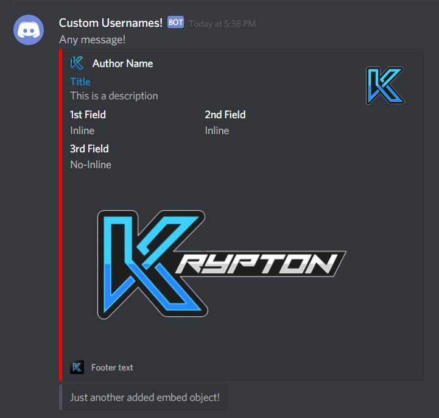

# Discord Webhook
Discord webhook to produce Embed or non-Embed messages to a specific discord chat.
## How to use

Example usage:
```java
DiscordProducer webhook = new DiscordWebhook("https://discordapp.com/api/webhooks/...");
    webhook.setContent("Any message!");
    webhook.setAvatarUrl("https://your.awesome/image.png");
    webhook.setUsername("Custom Usernames!");
    webhook.setTts(true);
    webhook.addEmbed(new DiscordWebhook.EmbedObject()
        .setTitle("Title")
        .setDescription("This is a description")
        .setColor(Color.RED)
        .addField("1st Field", "Inline", true)
        .addField("2nd Field", "Inline", true)
        .addField("3rd Field", "No-Inline", false)
        .setThumbnail("https://kryptongta.com/images/kryptonlogo.png")
        .setFooter("Footer text", "https://kryptongta.com/images/kryptonlogodark.png")
        .setImage("https://kryptongta.com/images/kryptontitle2.png")
        .setAuthor("Author Name", "https://kryptongta.com", "https://kryptongta.com/images/kryptonlogowide.png")
        .setUrl("https://kryptongta.com"));
    webhook.addEmbed(new DiscordWebhook.EmbedObject()
        .setDescription("Just another added embed object!"));
    webhook.execute(); //Handle exception
```


This will produce the next message:
